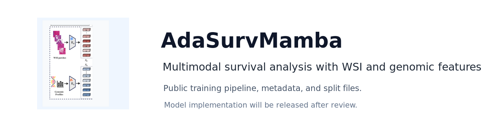

# AdaSurvMamba

<p align="center">
  
</p>

This repository is the public code skeleton for AdaSurvMamba, a multimodal survival analysis project using whole slide image features and genomic profiles.

The model implementation is intentionally not included in this release. The training, data loading, metadata, and split files are provided so the repository layout and experiment interface are available while the model code is reviewed for a later release.

## Environment

Create and activate the conda environment:

```bash
conda env create -f environment.yml
conda activate mambamil
```

## Data

The repository includes processed clinical/genomic metadata under `dataset_csv/` and 5-fold cross-validation split files under `splits/5foldcv/`.

Pre-extracted WSI feature tensors should be arranged as:

```text
<FEATURE_ROOT>/
  tcga_blca/UNI/pt_files/<slide_id>.pt
  tcga_brca/UNI/pt_files/<slide_id>.pt
  tcga_gbmlgg/UNI/pt_files/<slide_id>.pt
  tcga_luad/UNI/pt_files/<slide_id>.pt
  tcga_ucec/UNI/pt_files/<slide_id>.pt
```

Each `.pt` file is expected to contain patch-level features for one slide. Raw WSI preprocessing is outside the scope of this release.

## Usage

Inspect the command-line interface:

```bash
python main.py --help
```

Example training command:

```bash
python main.py \
  --data_root_dir <FEATURE_ROOT> \
  --split_dir tcga_blca \
  --which_splits 5foldcv \
  --model_type adasurvmamba
```

Until the model implementation is released, this command will stop at the model registry with a clear placeholder error.

## Citation

Citation information will be added after the final public release.

## License

This repository is released under the GPL-3.0 license. See `LICENSE` for details.
